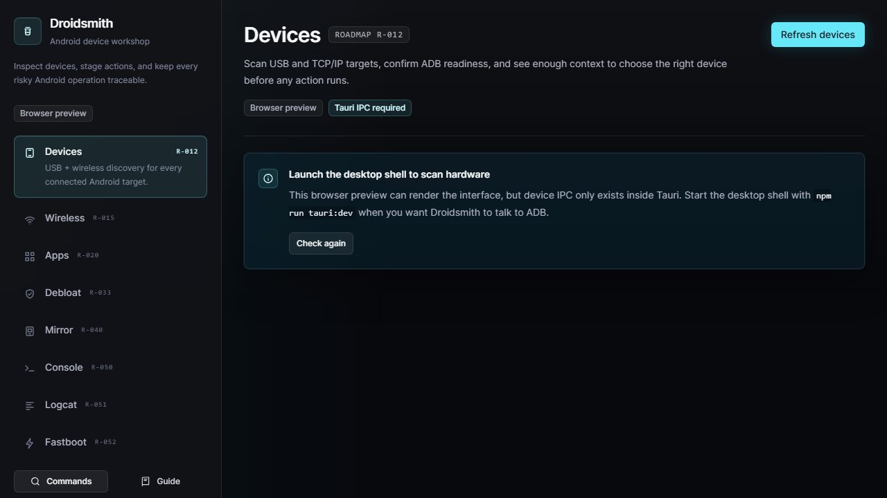
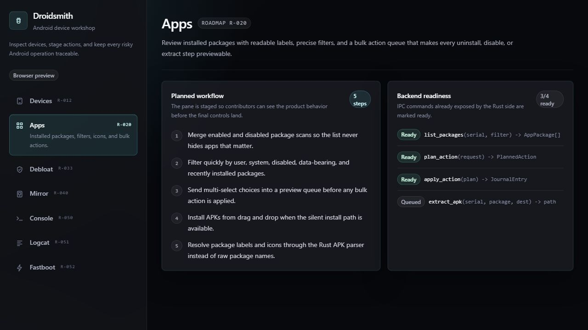
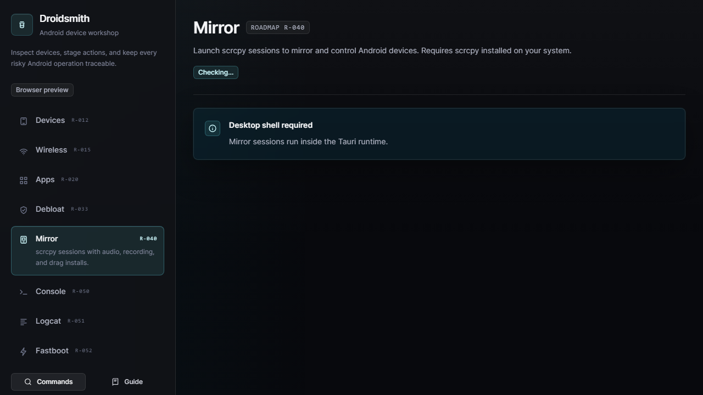

# Droidsmith


A cross-platform, open-source workshop for Android devices over ADB.

Droidsmith is the spiritual successor to [ADB AppControl](https://adbappcontrol.com) — a
modern, cross-platform GUI for managing Android devices through ADB, without
root, without a closed-source binary, without paywalled features.

## Status

Functional early desktop build. The Tauri shell builds and runs; shipped routes
cover device readiness, wireless ADB pairing/connect, package inventory and
actions, package backups, journal undo, debloat queue recovery, scrcpy launch
and session supervision, shell/logcat/file utilities, and fastboot inspection.

Current blockers are tracked separately in [Roadmap_Blocked.md](Roadmap_Blocked.md):
signed release pipeline, bundled platform-tools wiring, UAD-NG redistribution,
crash-log upload infrastructure, and the future plugin API/marketplace.
Remaining actionable work lives in [ROADMAP.md](ROADMAP.md); release notes live
in [CHANGELOG.md](CHANGELOG.md); design rationale is summarized in
[RESEARCH_REPORT.md](RESEARCH_REPORT.md).

## Screenshots

### Device Readiness



### Package Workflow



### Mirror Workflow



## Why another ADB GUI?

ADB AppControl is the closest thing the Windows ecosystem has to a polished
ADB front end, but it has hard limits that an open project can fix:

| | ADB AppControl 1.8.6 | Droidsmith |
|---|---|---|
| Source | Closed | MIT, public on GitHub |
| Platforms | Windows only (.NET 4.6+) | Windows, macOS, Linux |
| Free tier | Core only — dark theme, Process Manager, batch ops are sponsor-gated | All features always free |
| Debloat lists | Static, underperforms Universal Android Debloater per user reports | Versioned YAML packs and vendor quirks; UAD-NG import is blocked on redistribution permission |
| Screen mirror | Virtual buttons + screenshots | System scrcpy launch/supervision with per-device presets; bundled scrcpy remains planned |
| Wireless ADB | Manual `adb pair` in console | First-class pairing UI (Android 11+) |
| Automation | None | YAML profiles + headless CLI for reproducible device actions |
| Extensibility | None | Pack, quirk, and profile schemas now; plugin API and marketplace are deferred |
| i18n | EN + RU | i18next-driven, contributor-friendly |
| Multi-device | One at a time | Device selector and per-device workflows; side-by-side device tabs remain planned |

## Current tech stack

- **Tauri 2** — Rust core + native webview, single-binary distribution (~10 MB
  vs Electron's ~100 MB)
- **React + TypeScript + Vite** — frontend
- **ADB shell transport** — typed Rust wrappers around the platform-tools
  `adb` binary, with direct parser coverage for device/package/process/file
  transcripts
- **scrcpy on PATH** — detected and supervised for mirror/control sessions
- **YAML packs, quirks, and profiles** — packaged as Tauri resources for local
  linting and reproducible actions
- **Tailwind** — dark-first route surfaces
- **i18next** — translations

Bundled platform-tools and bundled scrcpy are not wired into the installer yet;
that work is held with release signing in [Roadmap_Blocked.md](Roadmap_Blocked.md).
See [RESEARCH_REPORT.md](RESEARCH_REPORT.md) for the rationale and the
alternatives considered.

## Repository layout

```
Droidsmith/
  src-tauri/        Rust backend, Tauri commands, ADB domain, CLI binary
  src/              React + TS frontend
  packs/            Community debloat packs (YAML)
  quirks/           Vendor failure explanations and mitigations (YAML)
  scripts/          Local development, resource, and sidecar helpers
  docs/             Development notes and screenshots
  ROADMAP.md
  Roadmap_Blocked.md
  CHANGELOG.md
  RESEARCH_REPORT.md
```

## Project planning

- [ROADMAP.md](ROADMAP.md) - active and planned roadmap items.
- [Roadmap_Blocked.md](Roadmap_Blocked.md) - work paused on external blockers.
- [CHANGELOG.md](CHANGELOG.md) - shipped roadmap history and release notes.
- [RESEARCH_REPORT.md](RESEARCH_REPORT.md) - research summary and archive index.

## Local verification

```bash
npm run format:check
npm run lint
npm run typecheck
npm test
npm run release:smoke
```

`npm run release:smoke` builds the frontend and Tauri bundle, checks bundled
resource metadata, validates third-party notices, and fails if expected local
installer artifacts are missing.

## Getting involved

Use [docs/DEVELOPMENT.md](docs/DEVELOPMENT.md) for local setup and verification.
Before proposing a new feature, check [ROADMAP.md](ROADMAP.md) and
[Roadmap_Blocked.md](Roadmap_Blocked.md) so blocked signing, sidecar,
redistribution, and plugin work does not get duplicated.

## License

MIT — see [LICENSE](LICENSE).
