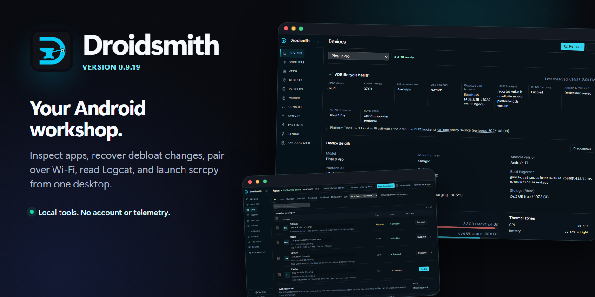
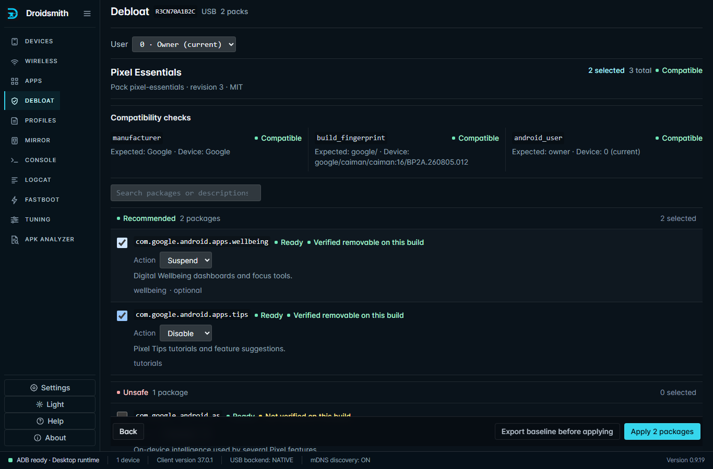
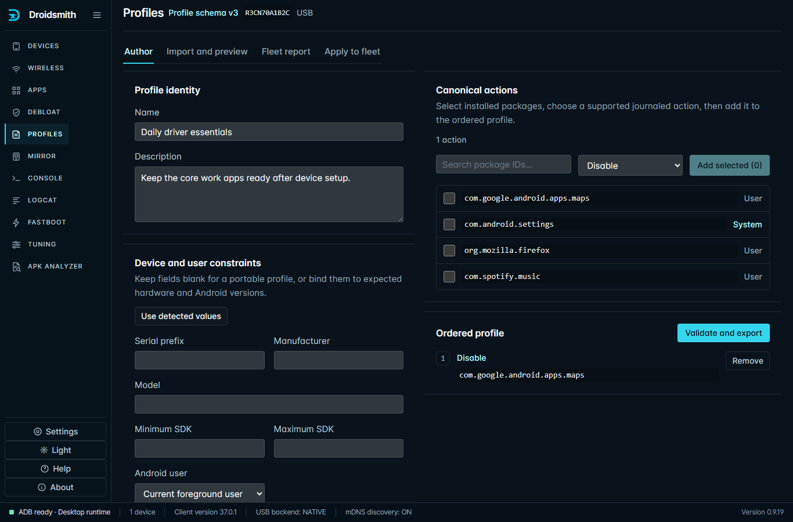
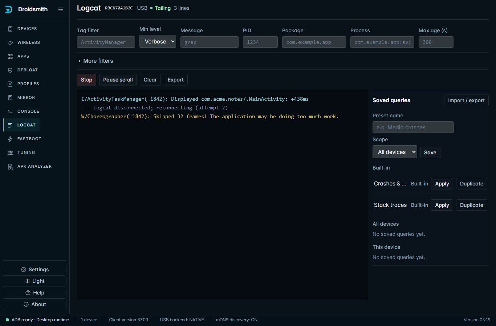
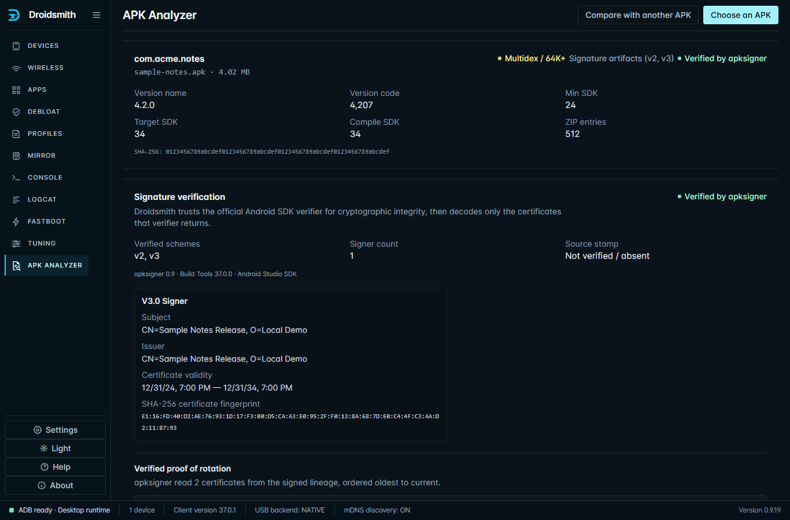

# Droidsmith

[](https://github.com/SysAdminDoc/Droidsmith/releases/tag/v0.9.19)
[](LICENSE)


**A local desktop workshop for Android devices over ADB.**

Droidsmith puts package management, debloat recovery, wireless pairing, Logcat,
scrcpy, and APK inspection in one desktop app. It works without root, an
account, or telemetry. Every feature is available in the open-source build.

[Download Droidsmith v0.9.19](https://github.com/SysAdminDoc/Droidsmith/releases/tag/v0.9.19)
| [Read the changelog](CHANGELOG.md)
| [Report a problem](https://github.com/SysAdminDoc/Droidsmith/issues/new/choose)

## See it in action


The device workspace makes connection state useful. It shows Android identity,
ADB readiness, transport provenance, storage, battery, and host recovery hints
before you start changing anything.

| App inventory and package actions | Reviewed debloat plans |
|---|---|
|  |  |

| Reusable profiles | scrcpy session setup |
|---|---|
|  |  |

| Filtered Logcat streams | Offline APK inspection |
|---|---|
|  |  |

These images are captured from the shipping renderer with deterministic local
fixtures. The capture exercises the real interface without changing a phone.

## What you can do

- Connect over USB, pair Android 11 or newer devices over Wi-Fi, and diagnose
  local ADB, driver, USB, mDNS, and authorization problems.
- Search a large app inventory, install APK bundles, export complete split APK
  sets, inspect permissions, and use device-supported reversible package states.
- Review debloat packs before applying them. Compatibility checks, risk tiers,
  per-device plans, action journals, and portable recovery baselines keep the
  result understandable.
- Launch supervised scrcpy sessions with device-aware settings. Recording,
  encoder recovery, display selection, virtual controls, and optional reverse
  tethering stay in the same workspace.
- Stream and export Logcat, inspect processes and historical exits, browse device
  files, capture bugreports, use Fastboot read-only checks, and tune selected
  settings with an exact preview.
- Inspect APK structure without a connected device. Droidsmith reports manifest
  metadata, permissions, DEX contents, signature artifacts, and size breakdowns.
- Save GUI-authored profiles or use the headless CLI for repeatable work across
  one device or a connected fleet.

## Why Droidsmith

Most ADB front ends focus on one job. Droidsmith is built around the whole
maintenance session, from connection triage to a reviewed change and a record
of what happened.

| Need | Droidsmith approach |
|---|---|
| Know what is connected | Shows device identity, Android user, transport type, and host health together |
| Remove unwanted apps carefully | Plans first, checks the device, records results, and offers recovery where Android permits it |
| Work without a cloud account | Keeps settings, reports, journals, and diagnostics on the machine |
| Repeat a known setup | Exports versioned profiles and runs the same planner from the GUI or CLI |
| Understand failure | Preserves bounded tool output and adds a plain-language recovery path |

The interface is available in English, German, Spanish, Russian, and Chinese.
Dark and light themes are included.

## Install

### Windows

Choose the build that fits the machine:

- [NSIS installer](https://github.com/SysAdminDoc/Droidsmith/releases/download/v0.9.19/Droidsmith_0.9.19_x64-setup.exe) for a normal per-user setup.
- [MSI installer](https://github.com/SysAdminDoc/Droidsmith/releases/download/v0.9.19/Droidsmith_0.9.19_x64_en-US.msi) for managed deployment.
- [Portable executable](https://github.com/SysAdminDoc/Droidsmith/releases/download/v0.9.19/Droidsmith_0.9.19_x64_portable.exe) when installation is not wanted.

Verify any download against the release's
[`SHA256SUMS`](https://github.com/SysAdminDoc/Droidsmith/releases/download/v0.9.19/SHA256SUMS)
before running it. A deterministic
[CycloneDX SBOM](https://github.com/SysAdminDoc/Droidsmith/releases/download/v0.9.19/Droidsmith_0.9.19_SBOM.cdx.json)
is published beside the installers.

Windows binaries are published for x64. macOS and Linux users can build the
Tauri app from source using the steps below.

### Host tools

Android SDK Platform Tools must be installed and `adb` must be on `PATH` for
device workflows. `scrcpy` is optional and enables the Mirror workspace.
Android SDK Build Tools plus Java are optional; when available, Droidsmith can
ask the official `apksigner` tool for deeper APK verification.

The Platform Tools policy was reviewed on 2026-08-08, recommends 37.0.1, and warns (without blocking) below
36.0.2. Older tools can still be detected, but known-bad builds are refused.

Quick host check:

```powershell
adb version
adb devices -l
scrcpy --version
```

Then open Droidsmith, wake the phone, pass its lock screen, and accept its USB
debugging prompt. Select the device in the sidebar. The Devices screen explains
any remaining readiness problem.

## Safety model

Droidsmith treats a connected phone as real hardware, not a disposable test
target.

- Read-only discovery happens before controls are enabled.
- Package and device mutations show an exact plan first. High-risk paths need a
  deliberate acknowledgement inside the review surface.
- Reversible actions write a local journal and verify the resulting device
  state. Undo appears only when the evidence supports it.
- User-installed app removal and some OEM package states cannot be restored by
  ADB. Droidsmith labels those boundaries instead of promising recovery.
- Portable baselines contain hashed device identity and package state. They do
  not contain raw serials, APK paths, user data, or credentials.
- Diagnostics are previewed and redacted locally. Android bugreport archives can
  contain private data, so Droidsmith never scans, opens, attaches, or uploads
  them.

Legacy or unverified TCP transports are treated as unsafe. USB and paired TLS
Wi-Fi follow the normal path; risky transport use needs an explicit override.

## Profiles and automation

Profiles turn a reviewed package plan into a versioned YAML document. Filters
can match package state, installer, Android user, manufacturer, model, and SDK
range. Import always opens a live diff before applying anything.

The current extension surface is schema-only: this build accepts schema version
`"1"` for packs and quirks and version `"3"` for profiles. Profile v1 has a
reviewed migration. Profile v2 remains loadable and can be upgraded explicitly.

The companion CLI uses the same validation and planner as the desktop app:

```bash
droidsmith-cli devices --json
droidsmith-cli packages --device SERIAL --filter all --json
droidsmith-cli run profile-v3.yaml --device SERIAL --dry-run --json
droidsmith-cli run profile-v3.yaml --device SERIAL --apply --json
```

Debloat packs can be planned for one device or a connected fleet:

```bash
droidsmith-cli pack list --json
droidsmith-cli pack plan pixel-stock --device SERIAL --json
droidsmith-cli pack apply pixel-stock --all-devices --dry-run --json
```

Fleet reports identify devices by digest and can resume only work that the prior
report proves unfinished. Profile or device drift blocks an apply until it has
been reviewed through a new dry run.

`droidsmith-mcp` exposes the same local planner over MCP stdio. It opens no HTTP
listener. Mutation tools require `confirmed: true` after their read-only plan
has been reviewed.

## Recovery baselines

Before a package batch, export a recovery baseline from the review screen. It
records the states needed to plan a restore without claiming to back up app
data. The Apps workspace supports both sides of a system update:

1. Restore recoverable package states before the update.
2. Install the Android update.
3. Inspect the same baseline against the new build.
4. Reapply only the states that changed.

The CLI exposes that workflow too:

```bash
droidsmith-cli baseline-export profile.yaml --device SERIAL --output baseline.json
droidsmith-cli baseline-inspect baseline.json --device SERIAL --json
droidsmith-cli baseline-apply baseline.json --device SERIAL --direction restore --dry-run
droidsmith-cli baseline-apply baseline.json --device SERIAL --direction reapply --dry-run
```

Run the reviewed command again with `--apply` when its plan is correct.

## Build from source

Requirements:

- Node.js `^22.12.0 || >=24.0.0`
- Rust `>=1.90`
- Tauri 2 system prerequisites for the host platform
- Android SDK Platform Tools for device testing

```bash
git clone https://github.com/SysAdminDoc/Droidsmith.git
cd Droidsmith
npm ci
npm run tauri:dev
```

Build the frontend or native bundles with:

```bash
npm run build
npm run tauri:build
```

Useful local checks:

```bash
npm test
npm run lint
npm run ui:smoke
npm run marketing:generate
npm run release:check
```

`npm run marketing:generate` refreshes every README screenshot in a headless
browser and rebuilds the repository social card. `npm run marketing:check`
verifies image dimensions, file weight, README references, and public version
links.

## Supported versions and release facts

| Contract | Supported value |
|---|---|
| Droidsmith source/manifests | `0.9.19` |
| Node.js | `^22.12.0 \|\| >=24.0.0` |
| Rust | `>=1.90` |
| Tauri | `2.x` |
| Android SDK Platform Tools | `37.0.1` recommended; warn below `36.0.2` |
| Pack / quirk documents | schema `"1"` / `"1"` |
| Profile documents | schema `"3"`; v1 has a reviewed import migration |

Release artifacts are unsigned and Droidsmith does not check for or install application updates.

## Project map

```text
src/                    React interface, state, routes, and translations
src-tauri/              Rust core, Tauri commands, CLI, MCP server, and bundles
packs/                   Reviewed debloat definitions
quirks/                  Device-specific behavior records
scripts/                 Local checks, capture tools, and packaging helpers
docs/screenshots/        Current product captures used by this README
```

Architecture and product decisions are documented in [RESEARCH.md](RESEARCH.md).
Planned work is tracked in [ROADMAP.md](ROADMAP.md), and release history lives in
[CHANGELOG.md](CHANGELOG.md).

## Contributing

Start with [CONTRIBUTING.md](CONTRIBUTING.md). Bug reports should include the
affected workflow, reproduction steps, and redacted diagnostics. Do not attach
raw Android bugreports, serials, pairing codes, credentials, or unreviewed
support bundles to a public issue.

Changes should add coverage for both the success path and useful failure states.
Run `npm run release:check` before submitting work. Pack and quirk changes must
also pass the generated schema checks.

Security reports belong in a
[private GitHub advisory](https://github.com/SysAdminDoc/Droidsmith/security/advisories/new).
See [SECURITY.md](SECURITY.md) for the supported line and disclosure process.

## License

[MIT](LICENSE)
