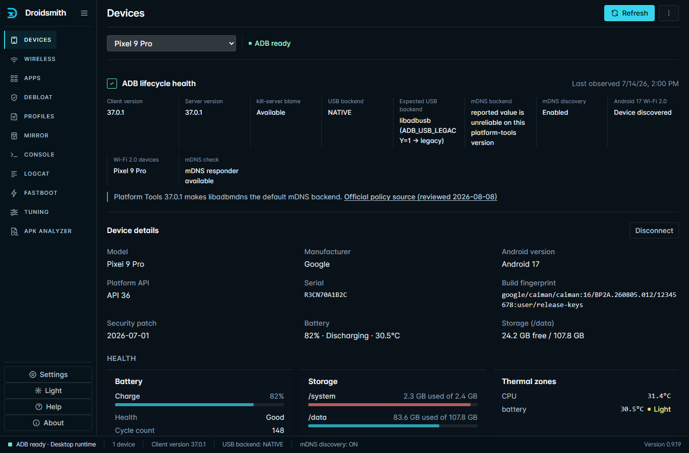
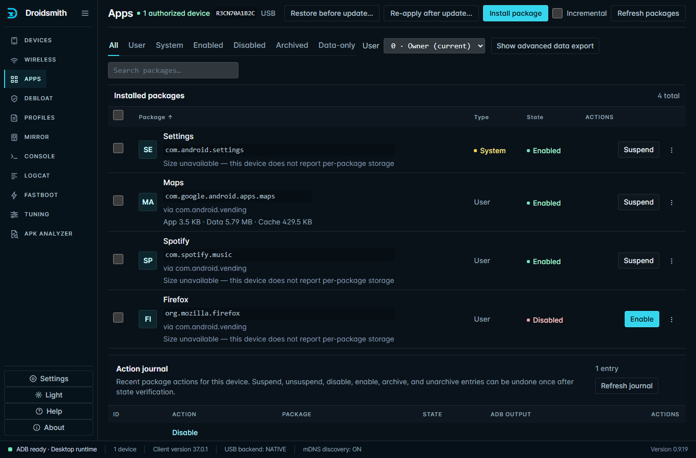
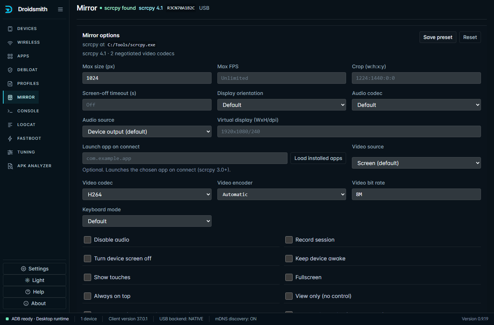

<p align="center">
  
</p>

<h1 align="center">Droidsmith</h1>


A cross-platform, open-source workshop for Android devices over ADB.

Droidsmith is the spiritual successor to [ADB AppControl](https://adbappcontrol.com) — a
modern, cross-platform GUI for managing Android devices through ADB, without
root, without a closed-source binary, without paywalled features.

## Status

Functional early desktop build. The Tauri shell builds and runs; shipped routes
cover device readiness, wireless ADB pairing/connect, package inventory and
actions with real PackageManager-reported per-app storage,
runtime-probed reversible package suspension, reversible Android 15
package archiving, atomic
APK/APKS/XAPK/APKM installation with guarded failure remedies and an opt-in
`--incremental` single-APK mode that falls back cleanly when unsupported,
hashed base/split APK export, audited permission/device-control mutations, reviewed shell
mutations, journal undo, debloat queue recovery, scrcpy launch and session
supervision, optional gnirehtet reverse-tethering ("Share Internet") when the
binary is on PATH, cancellable background shell/export/file operations, incremental
Logcat streaming and export, live cross-route device hot-plug updates from ADB's
runtime-probed structured text-proto tracker (with a legacy text fallback), ADB
server/mDNS/Wi-Fi 2.0 health with audited guided recovery, provenance-classified
USB/TLS/legacy/unknown transports with fail-closed unsafe-TCP acknowledgement,
read-only host connection diagnostics for ADB/tool/USB/driver/udev state,
portable pre-change recovery baselines with read-only OTA drift review,
GUI-authored schema-v3 action profiles with filter predicates resolved
against the live device and read-only import diffs,
native-selected scrcpy recording destinations, fastboot inspection, and an
offline APK Analyzer that statically inspects a local `.apk` (manifest,
permissions, DEX/multidex, signature artifacts, size breakdown) with no device
attached. When compatible Android SDK Build Tools and Java are available, the
same local workflow optionally uses the official `apksigner` to verify archive
integrity, signing schemes, signer/source-stamp certificates, and
proof-of-rotation lineage. Missing or incompatible tooling is reported as Not
verified and never blocks the Java-free static report. A
local-only Diagnostics center previews and saves redacted support
bundles with tool/OS/ADB health, failed-operation records, and crash excerpts;
it never uploads data and can wipe disposable local diagnostic history. For
deeper device failures, users can separately acknowledge a sensitive-data
warning and capture an atomic Android bugreport ZIP plus a redacted hash
sidecar; Droidsmith never scans, opens, attaches, or uploads the report.

The Settings dialog can export and import a versioned portable JSON document
covering language, mirror presets, Logcat query libraries, wireless history,
and auto-reconnect. Imports show a value-free merge/replace summary before any
write and create a restorable pre-import backup. Hashed device fingerprint
observations remain machine-local and are explicitly excluded from portable
files.

The Devices file manager browses and pulls files and now also supports guarded
push, folder creation, same-directory rename, and delete. Every mutation shows
the exact native-selected source, device target, and argument boundaries before
confirmation, writes a durable journal outcome, verifies the resulting device
state, and refreshes the current directory. Device paths with spaces, trailing
whitespace, shell punctuation, or non-ASCII names remain distinct through
POSIX single-quoting at the `adb shell` boundary instead of interpolated shell
text. The device dashboard also includes a read-only layout inspector: one click
captures the on-screen UI hierarchy with `uiautomator dump`, renders it as a
searchable, depth-indented node tree (class, resource-id, text, content-desc,
bounds), and exports the raw XML through a one-shot save grant. Malformed dumps
surface visible parse errors instead of being dropped. The same capture now
audits missing accessible labels, duplicate resource IDs, and density-aware
touch targets smaller than 48dp; JSON/text reports remain local and explicitly
exclude color-contrast claims.

On Android 10 (SDK 29) and newer builds that expose Perfetto, Devices also
offers three fixed system-trace presets. Each shows its sources, duration, ring
buffer, and 64 MB output ceiling before capture. A privacy acknowledgement and
one-shot native destination are required; cancellation, timeout, disconnect,
and size-limit paths attempt remote-temporary cleanup, while success atomically
installs a local `.perfetto-trace` for Reveal or Open With. Droidsmith does not
upload traces or embed a trace viewer.

Per-user removal now records package provenance and post-state immediately
around the mutation. A preinstalled system app is undoable from Activity only
when PackageManager proves its APK remains retained for that Android user;
user-installed `/data/app` packages and unknown/OEM states remain explicitly
irreversible. Recovery uses `install-existing`, restores the prior enabled state,
and verifies the result before linking the undo journal row.

Apps probes each selected device's own `pm help` before offering package
suspension. When both subcommands are advertised, Suspend becomes the default
persistent action ahead of disable, archive, and uninstall. Suspend/unsuspend
capture the selected Android user's state from PackageManager before and after
the mutation, require an exact transition, and record a verified journal
inverse. Devices that omit either command never show the corresponding action.

Debloat YAML packs can now declare a preferred action per package: `suspend`,
`disable`, `archive`, or `uninstall_for_user`. The review surface shows each
resolved action and permits only equal-or-safer overrides; the planner probes
the selected device's advertised PackageManager commands and skips unsupported
actions. Existing packs omit the field and retain the historical `disable`
default, while the apply queue verifies the journal's exact post-state.

Package export defaults to a ZIP containing every base/split APK plus a
versioned manifest with artifact hashes and hashed device/build identity. The
deprecated `adb backup` path is hidden under Advanced, preflights target SDK,
debuggable, and `allowBackup` evidence when OEM output exposes it, and emits an
uncompressed `.ab` inside a manifest-bearing ZIP only after strict header/TAR
validation. Detected data entries are not a promise of completeness or future
restore compatibility; Droidsmith does not present `adb restore` as a reliable
recovery path.

The source tree and manifests are version `0.9.17`. As checked on 2026-08-02,
the newest downloadable GitHub artifact is the older
[v0.5.3 release](https://github.com/SysAdminDoc/Droidsmith/releases/tag/v0.5.3),
published on 2026-07-17; changes after that tag are available from source but
are not yet published release artifacts. Remaining actionable work lives in
[ROADMAP.md](ROADMAP.md), release notes live in [CHANGELOG.md](CHANGELOG.md),
and current product/architecture findings live in [RESEARCH.md](RESEARCH.md).

## Screenshots

### Device Readiness



### Package Workflow



### Mirror Workflow



## Why another ADB GUI?

ADB AppControl is the closest thing the Windows ecosystem has to a polished
ADB front end, but it has hard limits that an open project can fix:

| | ADB AppControl 1.8.6 | Droidsmith |
|---|---|---|
| Source | Closed | MIT, public on GitHub |
| Platforms | Windows only (.NET 4.6+) | Windows, macOS, Linux |
| Free tier | Core only — dark theme, Process Manager, batch ops are sponsor-gated | All features always free |
| Debloat lists | Static | Versioned YAML packs with per-entry reviewed actions, vendor quirks, recovery baselines, and a final count/unsafe-tier review before apply; external data imports require provenance and redistribution review |
| Screen mirror | Virtual buttons + screenshots | Capability-negotiated scrcpy launch/supervision with per-device presets, encoder selection, and actionable bounded failure diagnostics; bundled scrcpy remains planned |
| Wireless ADB | Manual `adb pair` in console | First-class Android 11+ pairing, exact mDNS TLS provenance, explicit legacy/unknown TCP warnings, and privacy-bounded VPN/mDNS failure guidance |
| Automation | None | GUI-authored YAML profiles, explicit v1 migration, live dry-run diffs, and a JSON-capable headless CLI |
| Extensibility | None | Versioned local pack, quirk, and profile schemas; plugin API and marketplace are deferred |
| i18n | EN + RU | i18next-driven (DE, EN, ES, RU, ZH), contributor-friendly |
| Multi-device | One at a time | Device selector and per-device workflows; side-by-side device tabs remain planned |

## Current tech stack

- **Tauri 2** — Rust core, native webview, and platform installers
- **React + TypeScript + Vite** — frontend
- **ADB shell transport** — typed Rust wrappers around the platform-tools
  `adb` binary, with a bounded, dependency-free decoder for the structured
  device-tracking channel and direct parser coverage for legacy device,
  package, process, and file transcripts. Per-device connection state and link
  speed appear only when ADB publishes those fields.
- **Lazy APK metadata** — Apps rows near the viewport gain bounded,
  identity-cached labels and raster icons without pulling every installed APK
- **scrcpy on PATH** — version and device encoders are probed, cached against
  the binary identity, and supervised with bounded failure diagnostics for
  mirror/control sessions
- **Versioned YAML packs, quirks, and profiles** — packaged as Tauri resources
  for local linting and reproducible actions
- **Tailwind** — shared light/dark theme tokens and route surfaces
- **i18next** — translations

Bundled platform-tools and bundled scrcpy are not wired into the installer yet;
install those tools on the host when their workflows are needed.
The current extension surface is schema-only: this build accepts schema version
`"1"` for packs and quirks and version `"3"` for profiles. Profile v1 has an
explicit review-and-migrate path; future revisions are rejected with migration
guidance. The plugin API and marketplace remain deferred.

## Architecture and safety boundaries

- The React renderer owns presentation and calls generated, typed Tauri IPC
  bindings. It does not invoke host tools or read arbitrary host paths directly.
- Rust command handlers validate device identity, Android user, transport,
  native file grants, and argument boundaries before reaching the ADB, scrcpy,
  profile, journal, or diagnostics domains.
- External tools are launched with argument arrays and bounded capture. Reviewed
  shell mutations use dedicated quoting and validation rather than interpolated
  user commands.
- Settings, action journals, profiles, and recovery baselines use versioned
  documents. Unknown future versions fail closed; replacement writes and
  pre-import backups are atomic.
- Tauri isolation and capability policy constrain the renderer-to-core boundary.
  Generated bindings, isolation parity, schema compatibility, and release
  resources are checked by `npm run release:check`.

## Supported versions and release facts

| Contract | Supported value |
|---|---|
| Droidsmith source/manifests | `0.9.17` |
| Node.js | `^22.12.0 \|\| >=24.0.0` |
| Rust | `>=1.90` |
| Tauri | `2.x` |
| Android SDK Platform Tools | `37.0.1` recommended; warn below `36.0.2` |
| Pack / quirk documents | schema `"1"` / `"1"` |
| Profile documents | schema `"3"`; v1 has a reviewed import migration |

The release gate derives these rows from the manifests and schema policies, so
stale documentation fails before packaging. Release artifacts are unsigned and
Droidsmith does not check for or install application updates.

## Profiles and headless automation

The **Profiles** workspace builds an ordered YAML profile from supported
journaled package actions. A profile can target the owner, foreground, or an
explicit discovered Android user and can optionally constrain the device serial
prefix, manufacturer, model, and SDK range. Export validates schema v3 and uses
an atomic, native-selected destination.

Import is read-only: Droidsmith validates the schema and live device/user
constraints, then shows every current-to-expected package state, readiness
reason, and exact planned ADB command. A v1 file is converted only in memory;
the user must review and save the migrated document before it can run. A v2
file loads and runs unchanged, and separately offers a reviewed upgrade to v3.

### Filter predicates (schema v3)

A profile step can carry a `filter` predicate instead of a `package`. Listing
packages by name makes a profile effectively device-specific — the same handset
from two carriers does not ship the same bloat — so a predicate lets one profile
describe intent and resolve it against whatever the device actually has:

```yaml
actions:
  - kind: disable
    package: com.example.known          # a concrete step, exactly as in v2
  - kind: disable
    filter: system & disabled & installer == "com.vendor.store"
```

Attributes are the ones the package inventory already carries: `system`,
`user_installed`, `enabled`, `disabled`, `archived`, `installer == "<id>"`, and
`android_user == <n>`. They combine with `&`, `|`, `!`, and parentheses (`&&`
and `||` are accepted too). The grammar is deliberately small and
non-backtracking — an LL(1) recursive-descent parser with capped input length,
nesting depth, and term count, and no regex — because a profile is a file
someone can hand you.

Evaluation is total and has three outcomes, not two. A predicate that needs an
attribute the device did not report (`installer` is the one that genuinely
happens; on a current Samsung handset roughly 480 of 540 packages report none)
is **undecidable**: the package is excluded and listed explicitly in the review,
never quietly selected. Both the import diff and `droidsmith-cli run` name every
package each predicate matched and every package it could not decide, before
anything is applied.

Schema v2 stays loadable and runnable; only v1 requires a migration, because
only v1 is genuinely ambiguous. Both upgrades are explicit:

```bash
droidsmith-cli migrate-v1 old-profile.yaml --output profile-v3.yaml --json
droidsmith-cli migrate-v2 profile-v2.yaml  --output profile-v3.yaml --json
```

The CLI uses the same validation and planning code. `--json` emits stable
machine-readable results, and exit codes are `0` for success, `1` for a failed
operation or incompatibility, `2` for invalid input, `3` when ADB is absent, and
`4` when a resume is blocked by drift (see below).

```bash
droidsmith-cli devices --json
droidsmith-cli migrate-v1 old-profile.yaml --output profile-v3.yaml --json
droidsmith-cli run profile-v3.yaml --device SERIAL --dry-run --json
droidsmith-cli run profile-v3.yaml --device SERIAL --apply --json
```

Pass `--all-devices` instead of `--device SERIAL` to fan a run over every
connected, authorized device ("fleet mode"). Each device is planned and applied
independently, and `--json` emits a `devices[]` array with one entry per device
(`outcome: ran | error | skipped`). Unauthorized/offline devices and
unauthenticated TCP transports (without `--allow-unsafe-transport`) are skipped,
not aborted; the exit code is `1` if any device was skipped or failed.

```bash
droidsmith-cli run profile-v3.yaml --all-devices --apply --json
```

Legacy or unknown TCP transports additionally require
`--allow-unsafe-transport`; USB and paired TLS Wi-Fi do not.

### Resuming an interrupted fleet run

A fleet report saved with `--json` can be replayed with `--retry-from`. Only
devices the report left failed or skipped are selected; a device the report
proves finished is never touched again, and an action the report proves applied
is never replayed — it is reported with `status: skipped` instead.

```bash
droidsmith-cli run profile-v3.yaml --all-devices --apply --json > fleet.json
# ...interrupted, or some devices were offline...
droidsmith-cli run profile-v3.yaml --retry-from fleet.json --dry-run --json
droidsmith-cli run profile-v3.yaml --retry-from fleet.json --apply --json
```

Before selecting anything, the resume re-proves that it is continuing the same
work: the report schema, the profile document hash, the ordered action set, the
per-device hashed identity, the resolved Android user, and the current
transport. Any mismatch is *drift*. Drift never blocks `--dry-run` — reviewing
it is what the dry run is for — but it blocks `--apply` with exit code `4` until
it is re-run with `--accept-drift`. An edited action set and an edited note are
reported as different drift classes, since only the first changes what would
run.

Reports are schema `2`. Schema `1` reports recorded neither the profile
fingerprint nor per-action kinds, so they cannot prove which work completed and
are refused with migration guidance rather than resumed on a guess. Each resume
writes a `lineage` block naming the source report's content digest, its
generation number, the devices it selected, and the devices it deliberately
excluded, so a chain of resumes stays auditable.

### Reviewing a fleet report in the app

The **Profiles** workspace has a third tab, **Fleet report**, that opens the
same saved JSON read-only and renders it: per-device outcome, failure reason or
skip cause, and every planned action with its result. It is available with no
device connected, because rendering a report reaches no device and makes no
network request — a batch can be reviewed on a machine that has none of its
hardware attached.

Devices are named by digest, never by serial, matching the redaction already
used by recovery baselines. Where the run bound the device, the digest covers
the serial and the verified build fingerprint; where it did not (an errored or
skipped device), it covers the serial alone and the row says so. Unknown schema
versions are refused with the same migration guidance the CLI gives. Reviewing
is all the app does — resuming remains `--retry-from` on the CLI, and the
review points at that command.

### ADB host recovery evidence

The Devices health panel records the Platform Tools server version, USB/mDNS
backends, and the exact backend override supported by the host OS. On a
verified 37.0.1-or-newer server, the reviewed ADB recovery sequence also keeps
the bounded `kill-server` requester chain in the local host-operation record
and shows it beside the copyable diagnostics. Older or unknown server
versions report that capability as unavailable instead of displaying an empty
chain. Host Doctor suppresses backend-toggle advice when it cannot verify the
server version.

## Portable recovery baselines

Before applying a package action in Apps or a selected Debloat batch, export a
versioned JSON recovery baseline from the review screen. The file contains the
hashed device identity, build fingerprint, Android user, optional pack revision,
requested actions, and only the package presence/enabled/system state needed for
recovery; it excludes the raw serial, APK paths, UIDs, and installer metadata.

Import is read-only: Droidsmith shows identity/build/user compatibility, packages
already matching, and every skipped mismatch before enabling the separate apply
button. Only reviewed enable/disable recovery plans use the portable baseline;
eligible retained-system-app recovery is deliberately limited to the same-device
Activity journal. User-installed and unverified historical removals are never
presented as safely undoable.

### The OTA round trip

A debloated device can break on a system update, and the accepted answer is to
restore everything, update, then re-debloat. Apps exposes both halves of that
explicitly — **Restore before update…** and **Re-apply after update…** — because
they are not symmetric and cannot be inferred from live state: immediately after
an update, a package the update reverted and a package that was never changed
look identical.

Restoring walks every recoverable package back to the state the baseline
recorded. Re-applying walks forward to the state the recorded actions produced,
and only for packages that no longer reflect them — a package already in the
wanted state produces no plan, so nothing is ever applied twice. Both directions
name, explicitly and identically, the packages the portable baseline cannot
recover: it records enable state only (that is what lets it survive the
fingerprint change), so a cleared-data or uninstalled package is listed as out
of its reach rather than quietly skipped.

The headless CLI exposes the same schema, diff engine, and both directions:

```bash
droidsmith-cli baseline-export profile.yaml --device SERIAL --output baseline.json
droidsmith-cli baseline-inspect baseline.json --device SERIAL
droidsmith-cli baseline-inspect baseline.json --device SERIAL --json

# Pre-OTA: review, then restore.
droidsmith-cli baseline-apply baseline.json --device SERIAL --direction restore --dry-run
droidsmith-cli baseline-apply baseline.json --device SERIAL --direction restore --apply

# ...take the update, then re-debloat.
droidsmith-cli baseline-apply baseline.json --device SERIAL --direction reapply --dry-run
droidsmith-cli baseline-apply baseline.json --device SERIAL --direction reapply --apply
```

`baseline-apply` recomputes the diff against the live device every time and
executes only what that diff marks ready, so there is no path from a stale plan
to a mutation. It targets one device, because a baseline is bound to a single
device identity; a baseline from a different device is refused rather than
applied as an empty plan.

Both baseline commands also accept `--all-devices`. `baseline-inspect
--all-devices` diffs one baseline against every connected device (read-only),
and `baseline-export --all-devices --output <dir>` writes one
`<serial>.json` baseline per device into a directory. Skip/error semantics and
exit codes match fleet `run`.

```bash
droidsmith-cli baseline-export profile.yaml --all-devices --output baselines/
droidsmith-cli baseline-inspect baseline.json --all-devices --json
```

Legacy or unknown TCP transports require the explicit
`--allow-unsafe-transport` flag for these CLI commands; USB and paired TLS Wi-Fi
do not.

## Repository layout

```
Droidsmith/
  src-tauri/        Rust backend, Tauri commands, ADB domain, CLI binary
  src/              React + TS frontend
  packs/            Community debloat packs (YAML)
  quirks/           Vendor failure explanations and mitigations (YAML)
  scripts/          Local development, resource, and sidecar helpers
  docs/             Committed product screenshots and mockups
  README.md
  ROADMAP.md
  CHANGELOG.md
  RESEARCH.md
```

## Project planning

- [ROADMAP.md](ROADMAP.md) - active and planned roadmap items.
- [CHANGELOG.md](CHANGELOG.md) - shipped roadmap history and release notes.
- [RESEARCH.md](RESEARCH.md) - current evidence and architecture assessment.

## Development setup

Prerequisites are Rust stable 1.90 or newer, Node.js 22.12 or newer (24 LTS
recommended; Node 20 reached end of life on 2026-04-30), and the
Tauri 2 OS dependencies: WebView2 plus MSVC build tools on Windows, Xcode
Command Line Tools on macOS, or WebKitGTK 4.1/GTK 3/AppIndicator/RSVG development
packages on Linux. Install Android SDK Platform Tools separately and put `adb`
on `PATH`, or set `ANDROID_HOME` / `ANDROID_SDK_ROOT`; the current bundles do
not include it. APK signature verification is optional: install current Android
SDK Build Tools plus Java, and Droidsmith discovers the newest stable
`apksigner` under those SDK roots or the default Android Studio SDK. Static APK
analysis remains available without either dependency.

```bash
npm install
npm run tauri:dev
```

For production artifacts:

```bash
npm run tauri:build
```

Tauri writes the platform bundle under `src-tauri/target/release/bundle/`.
These local builds and the currently published downloads are unsigned; no
code-signing or certificate step is part of this project. The operating system
may therefore show an unverified-publisher warning. The application is also
single-instance, so close an installed copy before launching a development
build.

## Local verification

```bash
npm run release:check
```

`npm run release:check` is the authoritative local release-policy gate. It
fails on frontend or Rust formatting/lint/type/test regressions, rendered-route
smoke failures, npm/Rust advisories, unreviewed Cargo licenses/sources/bans or
duplicate versions, invalid pack/quirk/profile YAML, version/resource drift,
stale supported-version documentation, dead local documentation links,
placeholder domains, unsupported distribution claims, and missing production
bundle artifacts. Install its Rust tools once with
`cargo install --locked cargo-audit cargo-deny`; every temporary exception in
`release-policy.json` names an owner, rationale, and absolute expiry date.

Platform Tools compatibility is governed by
[`platform-tools-policy.json`](platform-tools-policy.json). The policy was
reviewed on 2026-08-08, recommends 37.0.1, and warns (without blocking) below
36.0.2 except for explicitly listed known-bad releases. The policy pins the
same 37.0.1 archive for both fetch scripts. Unrecognized newer versions are
never blocked. Both scripts consume versioned official archive URLs and
SHA-256 pins; the release gate rejects policy, runtime, script, or
documentation drift.

Rust commands and DTOs generate `src/lib/bindings.ts` through Tauri Specta.
After changing an IPC signature, run `npm run bindings:generate`; the
authoritative gate runs `npm run bindings:check` and rejects stale generated
output. Keep renderer-only compatibility helpers in `src/lib/tauri.ts` instead
of duplicating Rust wire records.

The individual commands (`npm run format:check`, `npm run lint`,
`npm run typecheck`, `npm test`, `npm run test:coverage`,
`npm run security:audit`, `npm run ui:smoke`, and `npm run release:smoke`)
remain available for fast iteration. The coverage command uses the pinned V8
provider and gates the deterministic `src/lib` helper/state surface; route
rendering remains covered by the invisible rendered-route smoke gate.

Generate the offline release provenance inventory before publishing artifacts:

```bash
npm run provenance:generate
sha256sum -c provenance/SHA256SUMS
```

The command writes a deterministic CycloneDX 1.6 SBOM and SHA-256 manifest
under `provenance/` using the npm and Cargo lockfiles, offline Cargo metadata,
and the maintained third-party notices. Every component carries its declared
license or an explicit `NOASSERTION` marker; the SBOM also records a
reproducible serial number, timestamp, and generator metadata. It excludes npm
development-only packages and walks the Cargo runtime/build graph without
contacting a registry or requiring a built application bundle.
`npm run provenance:check`, also included in the release gate, regenerates the
inventory in memory, parses it, and requires exact package-URL parity with
those lockfile graphs. The generated directory is ignored so release
automation can attach fresh artifacts without dirtying the source tree.

Seeded fuzz targets for ADB/OEM text, YAML documents, journal JSONL, and scrcpy
text live under `src-tauri/fuzz`. The normal stable parser test lane replays
the checked-in seeds. On a supported Unix-like host with nightly Rust and
`cargo-fuzz` installed, run them from `src-tauri/fuzz` with `cargo fuzz run
adb_text` (or `yaml_documents`, `journal_jsonl`, or `scrcpy_text`); normal
builds do not compile fuzz tooling. Scheduled/manual CI runs each target for a
bounded 30-second budget and uploads any minimized artifacts without making
Windows/macOS release jobs depend on nightly LLVM.

`npm run ui:smoke` starts Vite with mocked Tauri IPC and checks sidebar
navigation and route focus, command-palette combobox/listbox semantics, modal
focus trapping/restoration, native table semantics, batched Logcat announcements,
document locale propagation, Apps action overlays, Debloat queue results,
ADB health/recovery review, the redacted Diagnostics preview/save/wipe flow,
the split-package install and explicit override-confirmation flow, cross-route
disconnect/reconnect behavior, incremental Logcat reconnect/cancel behavior,
unsafe-transport acknowledgement/reset behavior, and mobile/narrow overflow.
It also sweeps every route under a non-English locale at a 200%-zoom reflow,
drives the Apps loading/empty/error/stale-completion states, and asserts the
documented screenshots never show the desktop-required placeholder.
`npm run docs:screenshots` regenerates the committed README screenshots from that
same mocked-native state.
`npm run release:smoke` builds the frontend and Tauri bundle, checks bundled
resource metadata, validates third-party notices, and fails if expected local
installer artifacts are missing.

## Translation contributions

Locale files live in `src/locales/<code>.json`. Keep each locale's key tree
identical, add new supported language codes in `src/lib/i18n.ts`, and include
language selector labels plus locale/direction metadata under `language.*` and
`SUPPORTED_LANGUAGES`. Dates, numbers, document language, and document direction
derive from that metadata. Run `npm test -- src/lib/i18n.test.ts` before
submitting translation changes; it checks English/Russian parity, navigation
key coverage, and locale-sensitive formatting.

## Getting involved

Use the tracked
[bug and feature forms](https://github.com/SysAdminDoc/Droidsmith/issues/new/choose)
so reports include the workflow, environment, expected result, and safe
diagnostic context needed for review. Never attach Android bugreport archives,
raw serials, pairing codes, credentials, or unreviewed support data to a public
issue.

Before proposing a feature, check [ROADMAP.md](ROADMAP.md) and
[RESEARCH.md](RESEARCH.md) so existing work and deliberately deferred choices
are not duplicated. Contributions should preserve Droidsmith's local-first,
free, cross-platform design and keep destructive operations explicit,
journaled, and recoverable where Android permits.

For code changes:

1. Follow the Development setup above and use a conventional `feat:`, `fix:`,
   `refactor:`, `test:`, `perf:`, or `chore:` commit subject.
2. Add regression coverage for new behavior and failure paths. Backend logic
   that does not require a physical device belongs in Rust unit or fake-tool
   integration tests.
3. Run `npm run release:check`; it is the complete frontend, Rust, isolation,
   schema, security, rendered-route, and unsigned-bundle gate.

Pack and quirk contributions must validate against the generated schemas in
`packs/schema.json` and `quirks/schema.json`. Translation contributions must
keep every locale's key tree aligned with `src/locales/en.json`.

## License

MIT — see [LICENSE](LICENSE).
